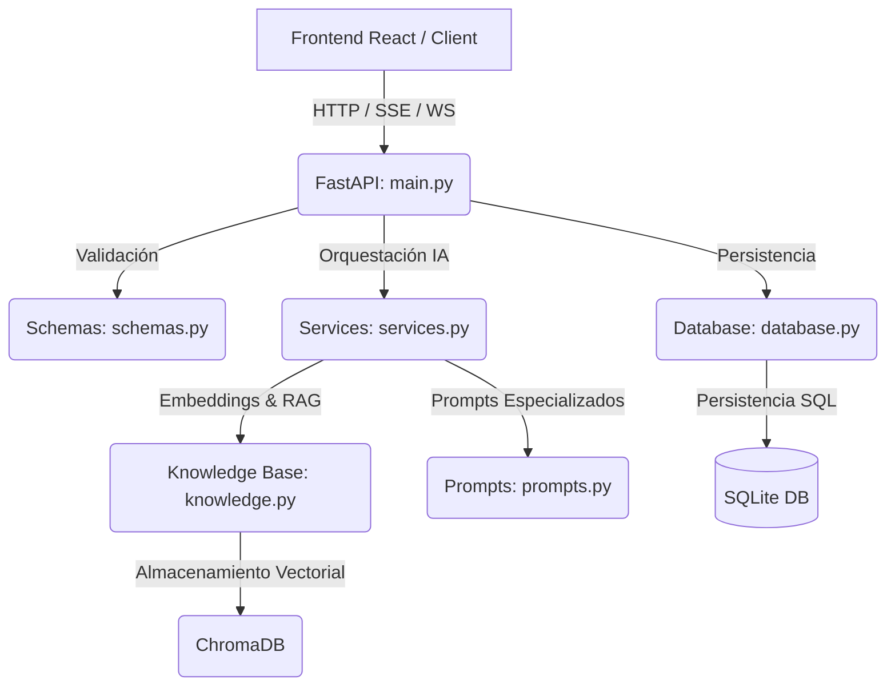

# EduAI Core - Motor de Generación de Sesiones de Aprendizaje

**EduAI Core** es el backend y motor de inteligencia artificial de **EduAI**, diseñado para ayudar a docentes peruanos a co-crear e interactuar con sesiones de aprendizaje personalizadas alineadas con el Currículo Nacional de la Educación Básica (CNEB) del MINEDU. 

El servicio está construido sobre **FastAPI** y aprovecha el modelo generativo de última generación de Google (Gemini) a través de técnicas de **Prompt Chaining** y salidas estructuradas, ofreciendo interfaces asíncronas de alto rendimiento (WebSockets y Server-Sent Events).

---

## 🛠️ Arquitectura del Sistema: ¿Cómo funciona el Backend?

El backend está estructurado de manera modular siguiendo principios de clean code y desacoplamiento de responsabilidades:



### 📋 Módulos Principales:
1. **`main.py` (Capa de API)**: Define las rutas REST, endpoints de Server-Sent Events (SSE) para streaming, controladores de WebSockets para co-creación en tiempo real y el manejo estructurado de excepciones HTTP de FastAPI.
2. **`services.py` (Lógica de IA y Prompt Chaining)**: Es el núcleo inteligente. Orquesta las llamadas al SDK de Gemini. Implementa un pipeline de generación en cadena (Prompt Chaining): primero genera los datos informativos de la sesión, luego la secuencia didáctica detallada y finalmente el instrumento de evaluación estructurado.
3. **`knowledge.py` (Base de Conocimientos / RAG)**: Descarga, procesa e indexa dinámicamente el currículo nacional en un almacén de vectores local (**ChromaDB**) usando **Gemini Embedding Functions**. Esto permite realizar búsquedas de similitud semántica para inyectar contexto pedagógico real en la generación.
4. **`database.py` (Persistencia de Datos)**: Maneja la base de datos relacional (**SQLite**). Gestiona las lecturas y escrituras seguras de los borradores, sesiones generadas, comentarios y likes de la comunidad mediante consultas parametrizadas.
5. **`schemas.py` (Validación de Esquemas)**: Define los tipos de datos estrictos usando **Pydantic** para validar los payloads de entrada y salida, asegurando que la IA siempre devuelva objetos JSON estructurados con el formato exacto requerido por el cliente.
6. **`prompts.py` (Ingeniería de Prompts)**: Centraliza los prompts del sistema del pipeline de IA, estructurados detalladamente para cumplir con las directrices pedagógicas de MINEDU.
7. **`utils.py` (Utilidades)**: Contiene funciones de parsing de mensajes multilínea, formateadores de duración pedagógica y sanitización de payloads de entrada.

---

## ⚙️ Requisitos y Configuración de Entorno

### 1. Archivo de Variables de Entorno (`.env`)
Para ejecutar la aplicación localmente, crea un archivo `.env` en la raíz del proyecto (este archivo se encuentra excluido de Git por motivos de seguridad) y define las siguientes variables:

```env
# API Key oficial de Google GenAI
GOOGLE_API_KEY=tu_google_api_key_aqui

# Nombre de la base de datos SQLite local
DB_NAME=lesson_memory.db

# URL para descargar el currículo nacional en formato texto
TXT_URL=https://raw.githubusercontent.com/angelmc-12/myfirstrepo/master/curriculo_texto.txt

# Token de seguridad de tu servidor local de SonarQube
SONAR_TOKEN=tu_token_de_sonarqube_aqui
```

---

## 🚀 Guía de Inicio Rápido en Local

### Paso 1: Clonar e instalar dependencias
Asegúrate de tener instalado Python 3.11 o superior.

```bash
# 1. Crear entorno virtual
python -m venv .venv

# 2. Activar entorno virtual
# En Windows (PowerShell):
.venv\Scripts\Activate.ps1
# En Linux/macOS:
source .venv/bin/activate

# 3. Instalar dependencias requeridas
pip install -r requirements.txt
```

### Paso 2: Iniciar la aplicación
Levanta el servidor local de desarrollo con recarga automática:

```bash
uvicorn main:app --host 0.0.0.0 --port 7700 --reload
```
La API estará disponible en `http://localhost:7700` y la documentación interactiva e interactuable de Swagger UI en `http://localhost:7700/docs`.

---

## 🧪 Pruebas Unitarias y Cobertura de Código

El backend cuenta con una suite integral de 50 pruebas que garantizan el correcto funcionamiento de toda la lógica, simulando las conexiones de base de datos e internet de manera aislada y segura en una base de datos de pruebas temporal (`test_lesson_memory.db`).

Para ejecutar los tests y verificar el reporte de cobertura en terminal:

```powershell
# Definir PYTHONPATH en PowerShell
$env:PYTHONPATH="."

# Ejecutar pytest y ver la cobertura detallada por módulo
pytest --cov=. --cov-report=term-missing
```

Para exportar el reporte en formato XML (requerido para subir la cobertura a SonarQube):

```powershell
pytest --cov=. --cov-report=xml
```
*Esto generará el archivo `coverage.xml` en la raíz del proyecto.*

---

## 📊 Integración Local con SonarQube (Cero Incidencias)

Hemos optimizado el backend para que cumpla rigurosamente con todos los estándares estáticos de SonarQube (**0 Bugs, 0 Vulnerabilities, 0 Code Smells, 0 Security Hotspots**).

### A. Iniciar el servidor local de SonarQube
Asegúrate de tener Docker instalado y en ejecución en tu equipo.

```bash
# Levantar el contenedor persistente de SonarQube
docker-compose -f docker-compose.sonar.yml up -d
```
El panel estará disponible en [http://localhost:9000](http://localhost:9000) (credenciales iniciales: `admin` / `admin`).

### B. Ejecutar el escáner de calidad
1. Crea un proyecto de forma manual en el panel de SonarQube con la clave de proyecto `eduai_core`.
2. Genera un token de análisis y guárdalo en tu archivo `.env` bajo el nombre `SONAR_TOKEN`.
3. Asegúrate de haber generado el archivo `coverage.xml` corriendo las pruebas previamente.
4. Ejecuta el script batch automatizado (para Windows):
   ```cmd
   .\run_sonar_scanner.bat
   ```
   *El script Batch leerá automáticamente de forma dinámica tu variable `SONAR_TOKEN` del archivo `.env` y subirá los resultados del análisis y la cobertura al servidor local.*

---

## 🐋 Construcción en Producción (Docker)

El backend de EduAI Core se encuentra securizado para su empaquetado en contenedores en entornos de producción:

- No ejecuta la aplicación bajo el usuario `root` de Linux (resuelve el Security Hotspot `docker:S6471` implementando un usuario sin privilegios `appuser`).
- Copia de manera selectiva y explícita los módulos requeridos, evitando el almacenamiento de archivos temporales locales (resuelve el Security Hotspot `docker:S6470`).

Para compilar y ejecutar de manera contenerizada:

```bash
# Compilar la imagen de Docker
docker build -t eduai-core:latest .

# Ejecutar el contenedor pasando tu API key de Google
docker run -d -p 7700:7700 -e GOOGLE_API_KEY="tu_api_key_aqui" --name eduai_backend eduai-core:latest
```